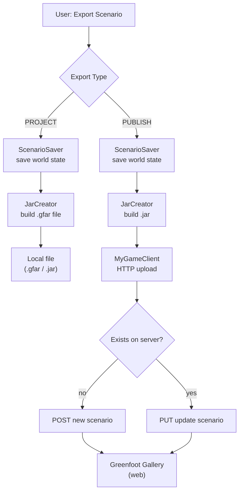

# Scenario Export

> Auto-generated from code analysis. Review and refine.

Scenario export and publishing system (9 files). Supports exporting Greenfoot scenarios as standalone JAR/GFAR files and publishing to the Greenfoot web gallery.

---

## Key Classes

| Class | Purpose |
|-------|---------|
| `Exporter` (singleton) | Manages export functions: PUBLISH to web, PROJECT as .gfar file |
| `ScenarioSaver` (interface) | Callback to save scenario state before publishing |
| `JarCreator` | Utility for creating JAR/ZIP files with manifests and classpaths |
| `GreenfootScenarioViewer` | Standalone scenario viewer entry point |

---

## MyGame Sub-package

The `mygame/` sub-package handles web gallery publishing:

| Class | Purpose |
|-------|---------|
| `MyGameClient` | HTTP client for Greenfoot web server communication |
| `ExportInfo` | Metadata for export (title, description, URL, lock status) |
| `ScenarioInfo` | Published scenario information |
| `ExistingScenarioChecker` | Checks if scenario already exists on server |
| `ProgressTrackingPart` | Tracks upload progress for UI feedback |

---

## Data Flows

### Export Pipeline

---

## Dependencies

**External:** Apache HTTP Client (for web publishing)

Uses: `core/` (project state), `guifx/export/` (export UI)

---

## Design Decisions

> TODO: Document rationale — cannot be inferred from code alone.
